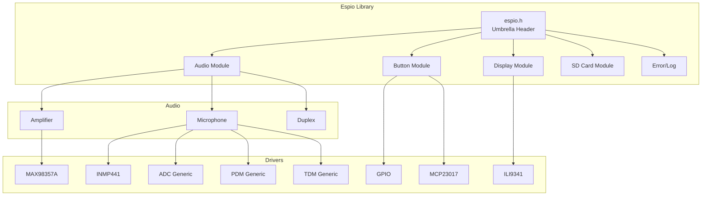

# Espio - ESP32 Peripheral I/O Library

A unified hardware abstraction library for ESP-IDF that simplifies working with common peripherals. Espio provides clean, consistent APIs for audio, buttons, displays, and SD card storage.

## Features

- **🔊 Audio Pipeline** - Amplifier output and microphone input with I2S, ADC, PDM, and TDM interfaces
- **🔘 Button Handling** - Debounced button input via GPIO or I2C expanders (MCP23017)
- **🖥️ Display Drivers** - LCD panel abstraction with SPI interface support
- **💾 SD Card Storage** - Filesystem access via SDMMC or SPI with a simple file API
- **⚡ Unified Error Handling** - Consistent error codes with rich context across all modules
- **🔧 Driver Architecture** - Swap hardware without changing application code

## Installation

### ESP Component Manager (Recommended)

Add to your project's `idf_component.yml`:

```yaml
dependencies:
  espio:
    git: https://github.com/mnikulenkov/espio.git
    version: "*"
```

### Manual Installation

Clone into your project's `components/` directory:

```bash
cd your-project/components
git clone https://github.com/mnikulenkov/espio.git
```

## Requirements

- **ESP-IDF**: Version 5.x
- **ESP32 variant**: Any ESP32, ESP32-S2, ESP32-S3, ESP32-C3, ESP32-C6, ESP32-H2, or ESP32-P4

## Quick Start

### Include the Library

```c
#include "espio/espio.h"
```

Or include individual modules:

```c
#include "espio/audio_amp.h"
#include "espio/audio_mic.h"
#include "espio/button.h"
#include "espio/display.h"
#include "espio/sd.h"
```

### Audio Amplifier Example

```c
#include "espio/audio_amp.h"
#include "espio/drivers/amp_max98357a.h"

// Configure MAX98357A I2S amplifier
espio_max98357a_config_t amp_config = {
    .i2s_port = I2S_NUM_0,
    .bclk_pin = 48,
    .lrclk_pin = 47,
    .din_pin = 1,
    .sample_rate = 44100,
};

espio_audio_config_t config = {
    .driver = &espio_max98357a_driver,
    .driver_config = &amp_config,
};

espio_audio_t* amp = espio_audio_create(&config);
espio_audio_set_power(amp, true);

// Get transport handle for sending PCM data
espio_audio_tx_t* tx = espio_audio_tx_create(&(espio_audio_tx_config_t){
    .write_timeout_ms = 1000,
});

// Start I2S transmission
espio_audio_tx_start(tx, amp);

// Write audio samples
int16_t samples[256];
espio_audio_tx_write(tx, samples, sizeof(samples));

// Cleanup
espio_audio_tx_stop(tx);
espio_audio_tx_destroy(tx);
espio_audio_set_power(amp, false);
espio_audio_destroy(amp);
```

### Microphone Example

```c
#include "espio/audio_mic.h"
#include "espio/drivers/mic_inmp441.h"

espio_inmp441_config_t mic_config = {
    .i2s_port = I2S_NUM_1,
    .bclk_pin = 42,
    .lrclk_pin = 41,
    .din_pin = 40,
    .sample_rate = 16000,
};

espio_audio_mic_config_t config = {
    .driver = &espio_inmp441_driver,
    .driver_config = &mic_config,
    .enable_software_gain = true,
};

espio_audio_mic_t* mic = espio_audio_mic_create(&config);
espio_audio_mic_set_power(mic, true);

// Create RX transport
espio_audio_mic_rx_t* rx = espio_audio_mic_rx_create(&(espio_audio_mic_rx_config_t){
    .read_timeout_ms = 1000,
});

espio_audio_mic_rx_start(rx, mic);

// Read audio samples
int16_t buffer[512];
size_t bytes_read;
espio_audio_mic_rx_read(rx, buffer, sizeof(buffer), &bytes_read);

// Cleanup
espio_audio_mic_rx_stop(rx);
espio_audio_mic_rx_destroy(rx);
espio_audio_mic_set_power(mic, false);
espio_audio_mic_destroy(mic);
```

### Button Example

```c
#include "espio/button.h"
#include "espio/drivers/button_gpio.h"

// Configure GPIO buttons
espio_button_gpio_provider_config_t provider_config = {
    .gpio_mask = (1ULL << 0) | (1ULL << 1), // Buttons on GPIO 0 and 1
};

espio_button_config_t config = {
    .provider_count = 1,
    .providers = (espio_button_provider_config_t[]){
        { .driver = &espio_button_gpio_driver, .config = &provider_config },
    },
    .debounce_ms = 20,
    .long_press_ms = 500,
};

espio_button_t* buttons = espio_button_create(&config);
espio_button_start(buttons);

// Poll for events
espio_button_event_t event;
while (espio_button_poll(buttons, &event, pdMS_TO_TICKS(100))) {
    if (event.type == ESPIO_BUTTON_EVENT_PRESSED) {
        printf("Button %d pressed\n", event.button_id);
    }
}

espio_button_destroy(buttons);
```

### Display Example

```c
#include "espio/display.h"
#include "espio/drivers/display_ili9341.h"
#include "espio/display_colors.h"

espio_ili9341_config_t display_config = {
    .spi_host = SPI2_HOST,
    .cs_pin = 5,
    .dc_pin = 4,
    .rst_pin = 3,
    .sck_pin = 6,
    .mosi_pin = 7,
    .clock_speed_hz = 40 * 1000 * 1000, // 40MHz
    .width = 320,
    .height = 240,
};

espio_display_config_t config = {
    .driver = &espio_ili9341_driver,
    .driver_config = &display_config,
};

espio_display_t* display = espio_display_create(&config);

// Fill screen with color
uint16_t* framebuffer = malloc(320 * 240 * sizeof(uint16_t));
for (int i = 0; i < 320 * 240; i++) {
    framebuffer[i] = ESPIO_RGB565(0, 100, 200); // Blue-ish color
}

espio_display_draw_bitmap(display, 0, 0, 320, 240, framebuffer);
free(framebuffer);

espio_display_destroy(display);
```

### SD Card Example

```c
#include "espio/sd.h"

espio_sd_config_t config = {
    .bus_mode = ESPIO_SD_BUS_MODE_SPI,
    .mount_point = "/sdcard",
    .max_open_files = 4,
    .spi = {
        .host_id = SPI3_HOST,
        .cs_pin = 18,
        .sck_pin = 16,
        .mosi_pin = 17,
        .miso_pin = 15,
        .clock_speed_hz = 10 * 1000 * 1000, // 10MHz
    },
};

espio_sd_t* sd = espio_sd_mount(&config);
if (!sd) {
    printf("Failed to mount SD card\n");
    return;
}

// Write a file
espio_sd_file_t* file = espio_sd_file_open(sd, "test.txt", 
    ESPIO_SD_OPEN_MODE_WRITE_TRUNCATE);
espio_sd_file_write(file, "Hello, Espio!", 13);
espio_sd_file_close(file);

// Read a file
file = espio_sd_file_open(sd, "test.txt", ESPIO_SD_OPEN_MODE_READ);
char buffer[64];
size_t bytes_read;
espio_sd_file_read(file, buffer, sizeof(buffer), &bytes_read);
buffer[bytes_read] = '\0';
printf("Read: %s\n", buffer);
espio_sd_file_close(file);

espio_sd_unmount(sd);
```

## Module Overview



## Currently Supported Drivers (In Progress)

### Audio Amplifiers
| Driver | Description |
|--------|-------------|
| `espio_max98357a_driver` | MAX98357A I2S Class D amplifier |

### Microphones
| Driver | Description |
|--------|-------------|
| `espio_inmp441_driver` | INMP441 I2S MEMS microphone |
| `espio_mic_adc_generic_driver` | Generic ADC-based analog microphone |
| `espio_mic_pdm_generic_driver` | Generic PDM digital microphone |
| `espio_mic_tdm_generic_driver` | Generic TDM multi-channel microphone |

### Buttons
| Driver | Description |
|--------|-------------|
| `espio_button_gpio_driver` | Direct GPIO button input |
| `espio_button_mcp23017_driver` | MCP23017 I2C port expander |

### Displays
| Driver | Description |
|--------|-------------|
| `espio_ili9341_driver` | ILI9341 SPI LCD controller |

## Error Handling

Espio uses a unified error system with rich context:

```c
#include "espio/err.h"

int32_t result = espio_audio_create(&config);
if (espio_err_is_fail(result)) {
    const espio_err_context_t* ctx = espio_err_get_last();
    ESPIO_LOGE(TAG, "Failed: component=%d code=%d msg=%s",
        ctx->component, ctx->code, ctx->message);
}
```

### Error Components

| Component | Description |
|-----------|-------------|
| `ESPIO_COMPONENT_COMMON` | Shared/generic errors |
| `ESPIO_COMPONENT_AUDIO` | Audio module errors |
| `ESPIO_COMPONENT_BUTTON` | Button module errors |
| `ESPIO_COMPONENT_DISPLAY` | Display module errors |
| `ESPIO_COMPONENT_SD` | SD card module errors |

## Configuration

Enable or disable modules via `idf.py menuconfig` under **Component config → Espio**:

- `ESPIO_ENABLE_AUDIO` - Enable audio module (default: y)
- `ESPIO_ENABLE_BUTTON` - Enable button module (default: y)
- `ESPIO_ENABLE_DISPLAY` - Enable display module (default: y)
- `ESPIO_ENABLE_SD` - Enable SD card module (default: y)

## API Reference

Full API documentation is available in the header files:

- [`espio/audio_amp.h`](espio/include/espio/audio_amp.h) - Amplifier API
- [`espio/audio_mic.h`](espio/include/espio/audio_mic.h) - Microphone API
- [`espio/audio_duplex.h`](espio/include/espio/audio_duplex.h) - Full-duplex audio
- [`espio/button.h`](espio/include/espio/button.h) - Button handling
- [`espio/display.h`](espio/include/espio/display.h) - Display abstraction
- [`espio/sd.h`](espio/include/espio/sd.h) - SD card filesystem
- [`espio/err.h`](espio/include/espio/err.h) - Error handling
- [`espio/log.h`](espio/include/espio/log.h) - Logging utilities

## Acknowledgments

Built on top of ESP-IDF's excellent peripheral drivers:
- [`esp_lcd`](https://docs.espressif.com/projects/esp-idf/en/latest/esp32/api-reference/peripherals/lcd.html) for display support
- [`esp_driver_i2s`](https://docs.espressif.com/projects/esp-idf/en/latest/esp32/api-reference/peripherals/i2s.html) for audio interfaces
- [`esp_vfs_fat_sdmmc`](https://docs.espressif.com/projects/esp-idf/en/latest/esp32/api-reference/storage/sdmmc.html) for SD card support